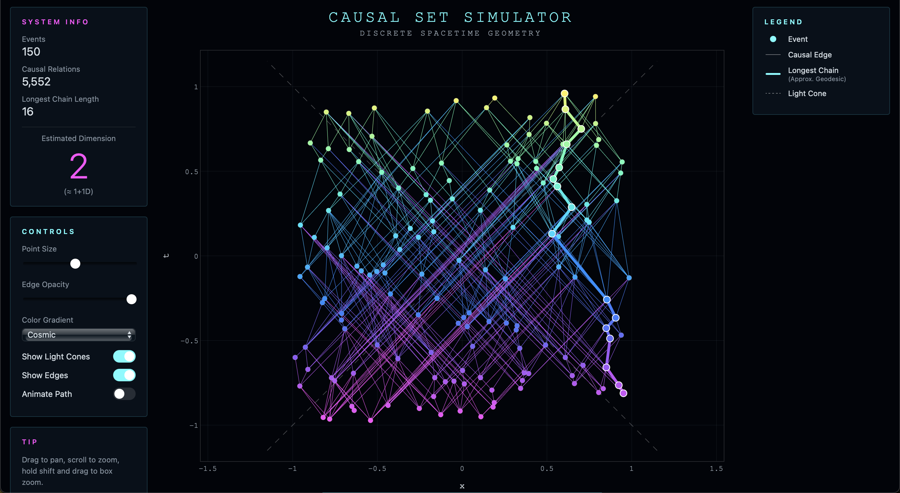

# Causal Set Simulator

A computational physics project exploring discrete spacetime geometry through causal set theory.

<p align="center">
  
</p>

## Overview

This project simulates spacetime as a discrete causal structure rather than a continuous geometric manifold.

The core idea from causal set theory is that spacetime geometry can emerge purely from causal order and discreteness. This project explores that idea computationally by modeling spacetime as a finite set of events connected through causal relationships determined by relativistic constraints. Random events in space and time are generated and connected only if they could realistically influence each other, forming a directed acyclic graph of causal structure that approximates Lorentzian geometry. The resulting graph is then analyzed to study emergent geometric properties, such as approximate geodesic paths and effective dimensional behavior.

---

## Features

#### Causal Structure
- Poisson spacetime sprinkling
- Relativistic causal relation detection
- Directed acyclic graph construction
- Transitive reduction

#### Emergent Geometry
- Geodesic approximation via longest chains
- Dimension estimation from chain scaling behavior

#### Spacetime Models
- Minkowski spacetime (special relativity)
- Schwarzschild spacetime (curved geometry support)

#### Tools
- Modular spacetime abstraction layer
- Interactive visualization

---

## Causal Set Interpretation

- events → nodes  
- causal relations → edges  
- geometry → emergent property of the graph  

Large-scale spacetime structure is recovered statistically from discrete order.

## Physics Background

### Minkowski Spacetime

The causal structure is determined using the Minkowski metric:

$$
ds^2 = -dt^2 + dx^2
$$

Two events A and B are causally connected if:

$$
(t_B - t_A)^2 - (x_B - x_A)^2 \ge 0, \quad t_B > t_A
$$

This defines the light-cone structure used to construct the causal graph.

---

## Computational Pipeline

```text
random spacetime events
        ↓
Lorentzian interval checks
        ↓
causal relation detection
        ↓
directed acyclic graph construction
        ↓
transitive reduction
        ↓
geodesic extraction
        ↓
dimension estimation
        ↓
interactive visualization
```
---


---


## Installation

Install dependencies:

```bash
pip3 install -r requirements.txt
```

## Run

From the repository root:

```bash
PYTHONPATH=. python3 examples/minkowski_demo.py
```
